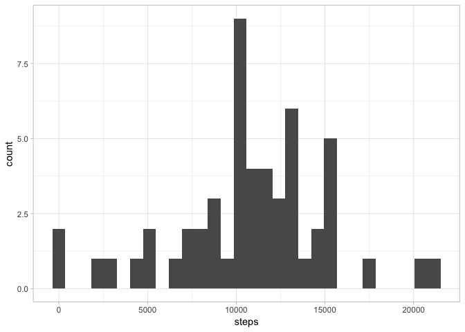
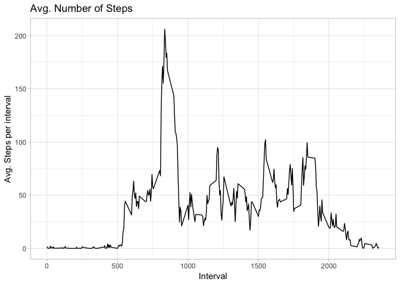
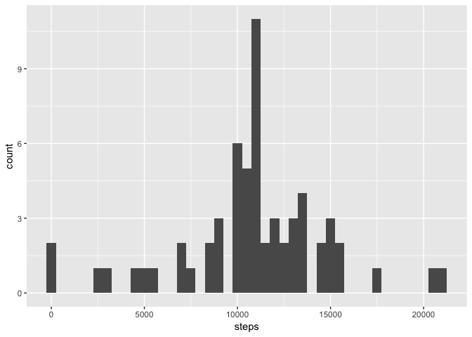
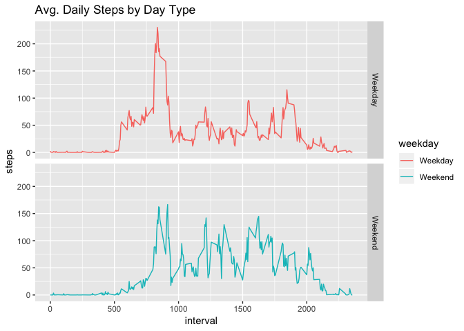

## Reproducible Research - Project 1

This assignment makes use of data from a personal activity monitoring device. This device collects data at 5 minute intervals through out the day. The data consists of two months of data from an anonymous individual collected during the months of October and November, 2012 and include the number of steps taken in 5 minute intervals each day.

First we load the dataset, The dataset is stored in a comma-separated-value (CSV) file and there are a total of 17,568 observations in this dataset.


```r
data <- data.table(read.csv("activity.csv"))
```

and we validate the number of observations:


```r
str(data)
```

```
## Classes 'data.table' and 'data.frame':	17568 obs. of  3 variables:
##  $ steps   : int  NA NA NA NA NA NA NA NA NA NA ...
##  $ date    : Factor w/ 61 levels "2012-10-01","2012-10-02",..: 1 1 1 1 1 1 1 1 1 1 ...
##  $ interval: int  0 5 10 15 20 25 30 35 40 45 ...
##  - attr(*, ".internal.selfref")=<externalptr>
```

### What is mean total number of steps taken per day?

For this part of the assignment, you can ignore the missing values in the dataset.

#### Make a histogram of the total number of steps taken each day


```r
stepsByDay <- aggregate(steps ~ date, data=data, FUN="sum")
ggplot(stepsByDay, aes(x=steps)) + geom_histogram(bins=30) + theme_light()
```

<!-- -->

#### Calculate and report the mean and median total number of steps taken per day


```r
stepsByDay %>% summarise(Mean=mean(steps), Median=median(steps))
```

```
##       Mean Median
## 1 10766.19  10765
```

### What is the average daily activity pattern?

#### Make a time series plot (i.e. type = "l") of the 5-minute interval (x-axis) and the average number of steps taken, averaged across all days (y-axis)


```r
meanByInterval <- data[, c(lapply(.SD, mean, na.rm = TRUE)), .SDcols = c("steps"), by = .(interval)] 

ggplot(meanByInterval, aes(x=interval, y=steps)) + geom_line() + theme_light() + labs(title="Avg. Number of Steps", x = "Interval", y="Avg. Steps per interval")
```

<!-- -->

#### Which 5-minute interval, on average across all the days in the dataset, contains the maximum number of steps?


```r
meanByInterval[steps==max(steps), .(maxInterval=interval)]
```

```
##    maxInterval
## 1:         835
```

### Imputing missing values


#### Calculate and report the total number of missing values in the dataset (i.e. the total number of rows with NAs)


```r
data[is.na(steps), .(NA_values = .N)]
```

```
##    NA_values
## 1:      2304
```

#### Devise a strategy for filling in all of the missing values in the dataset. The strategy does not need to be sophisticated. For example, you could use the mean/median for that day, or the mean for that 5-minute interval, etc.

We wiil fill in the NA values with the mean for that interva, so to that end we create a new column with the mean for each interval.


```r
intervalMean <- copy(data)
intervalMean[, mean:=c(lapply(.SD, mean, na.rm = TRUE)), .SDcols = c("steps"), by = .(interval)] 
```


#### Create a new dataset that is equal to the original dataset but with the missing data filled in.


For the rows with NA values we assign the mean value for the interval the missing value belongs to.


```r
intervalMean[is.na(steps), steps := as.integer(round(mean))]  
```

#### Make a histogram of the total number of steps taken each day and Calculate and report the mean and median total number of steps taken per day. Do these values differ from the estimates from the first part of the assignment? What is the impact of imputing missing data on the estimates of the total daily number of steps?


```r
withNA <- data[, c(lapply(.SD, sum, na.rm=FALSE)), .SDcols = c("steps"), by =.(date)]
withoutNA <- intervalMean[, c(lapply(.SD, sum)), .SDcols = c("steps"), by =.(date)]
ggplot(withoutNA, aes(x=steps)) + geom_histogram(binwidth = 500)
```

<!-- -->

```r
withNA$Desc = 'With NA values'
withoutNA$Desc = 'Without NA values'
compData <- rbind(withNA, withoutNA)
compData[, .(Mean = mean(steps, na.rm=TRUE), Median = median(steps, na.rm=TRUE)), by =.(Desc)]
```

```
##                 Desc     Mean Median
## 1:    With NA values 10766.19  10765
## 2: Without NA values 10765.64  10762
```

### Are there differences in activity patterns between weekdays and weekends?

#### Create a new factor variable in the dataset with two levels -- "weekday" and "weekend" indicating whether a given date is a weekday or weekend day.


```r
intervalMean[, date := as.Date(date)]
intervalMean[, weekday := ifelse(weekdays(date, abbreviate=TRUE) %in% c('Sat', 'Sun'), 'Weekend', 'Weekday')]
weekdata <- intervalMean[, c(lapply(.SD, mean, na.rm=TRUE)), .SDcols="steps", by = .(interval, weekday)]
weekdata[, weekday := as.factor(weekday)]
```

#### Make a panel plot containing a time series plot (i.e. type = "l") of the 5-minute interval (x-axis) and the average number of steps taken, averaged across all weekday days or weekend days (y-axis). The plot should look something like the following, which was created using simulated data:


```r
ggplot(weekdata, aes(x=interval, y=steps, color=weekday)) + geom_line() + facet_grid(rows=vars(weekday)) + labs(title="Avg. Daily Steps by Day Type")
```

<!-- -->
